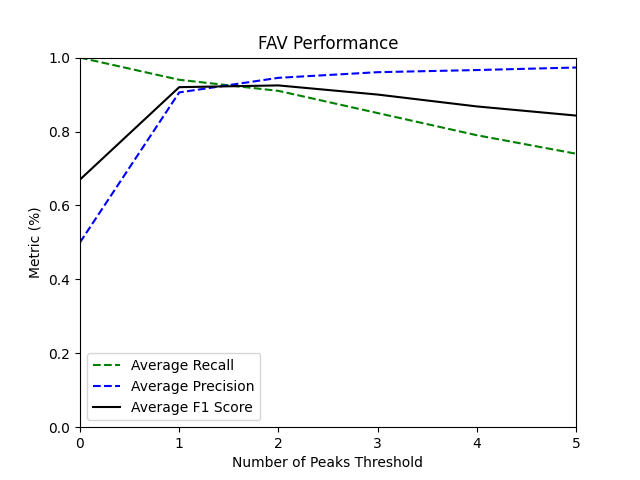
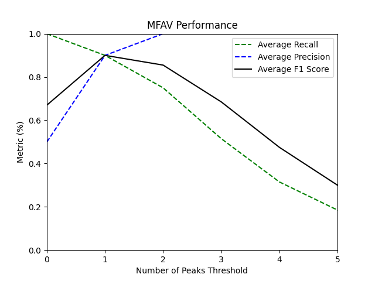
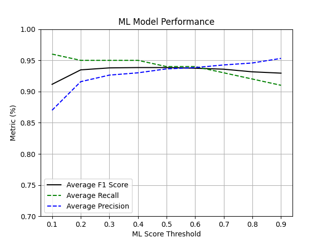

#
# Vessel-Noise-Detector Tool

## Disclaimer Notice!

This tool is licensed under the [GNU General Public License v3.0](https://www.gnu.org/licenses/gpl-3.0.html) (GPLv3). It is provided "as-is" without any warranty of any kind, either express or implied, including but not limited to the warranties of merchantability or fitness for a particular purpose.

The authors and copyright holders are not responsible for any damages arising from the use of this tool, including but not limited to direct, indirect, incidental, or consequential damages. By using this tool, you agree to assume all risks associated with its use. Please refer to the full text of the GPLv3 for more details on the terms and conditions of this license.

---
---

## Table of Contents
- [Summary](#summary)
- [Tool Performance](#tool-performance)
- [Limitation Notice and Practical Considerations](#limitation-notice-and-practical-considerations)
- [Required Libraries](#required-libraries)
- [Installation](#installation)
- [Usage](#usage)
- [Configuration Files](#configuration-files)
- [Data Processing Workflow](#data-processing-workflow)
- [Functions Description](#function-descriptions)

## Summary
The [vessel_noise_detector.py](./vessel_noise_detector.py) is a Python script developed to detect the presence of marine vessels within the coverage area of hydrophone receivers. The tool processes WAV audio data to identify noise signals from vessels within a marine soundscape record. It performs frequency-domain analysis using the FAV and modified FAV schemes (for a brief overview, refer to the accompanying [methods.pdf](./methods.pdf) document) to detect tonal frequency peaks associated with vessel noise. The analysis reports Sound Pressure Level (SPL, in dB) within specified frequency bands and the Signal-to-Noise Level Difference (SNLD, in dB) across narrow bands (ship tonals) surrounding the detected peak frequencies. Additionally, the script includes a trained deep learning model as an alternative vessel noise detector, though this model may require further tuning for optimal performance in new environments. When available, Automatic Identification System (AIS) data is utilized to offset false negative detections.

Users have the flexibility to customize various parameters to adapt the tool's functionality to their specific needs, such as the hydrophone calibration factor (frequency-independent only), machine learning model detection score threshold, the sensitivity of the MFAV method, and more. Some input parameters that are fixed for a particular environment and hydrophone are defined in an associated JSON configuration file. Additionally, users can adjust certain parameters via command-line arguments, offering greater flexibility for analysis and fine-tuning based on specific use cases.

The script includes error handling for file processing. If an error occurs while processing a WAV file, it logs the error message but continues processing the remaining files.

The tool generates CSV output files and saves them in a specified output directory. Depending on the selected method, one or more of the following CSV files are generated:

- `project_FAV_detections.csv`: Generated when the FAV method is selected.
- `project_MFAV_detections.csv`: Generated when the MFAV method is selected.
- `project_ML_detections.csv`: Generated when the ML method is selected.
- `project_MFAV_ML_detections.csv`: Generated when MFAV-ML option is selected, combining results from both the MFAV and ML detectors.

**Note:** The prefix 'project' is replaced with the specified project name from the config.json file.

An example of an project_MFAV_ML_detections output is shown below:

| filename | start time | end time | freq. band (Hz) | number of peaks | peaks freq. (Hz) | SPL (dB) | SNLD (dB) | AIS | ml_label | ml_score |
| -------- | ---------- | -------- | --------------- | --------------- | ---------------- | -------- | --------- | --- | -------- | -------- |
| 2017-ULU01_0+1_20170725_180602.wav | 2017-07-25 18:06:02 | 2017-07-25 18:07:42 | 50.0 - 1000.0 | 1 | [163.0] | 94.0 | [9.59] | None | 1 | 0.82 |
| 2017-ULU01_0+1_20170725_180602.wav | 2017-07-25 18:07:42 | 2017-07-25 18:09:22 | 50.0 - 1000.0 | 1 | [138.5] | 93.0 | [5.52] | None | 1 | 0.95 |
| 2017-ULU01_0+1_20170725_180602.wav | 2017-07-25 18:09:22 | 2017-07-25 18:11:02 | 50.0 - 1000.0 | 1 | [122.5] | 93.0 | [7.24] | None | 1 | 0.99 |
| 2017-ULU01_0+1_20170725_193602.wav | 2017-07-25 19:36:02 | 2017-07-25 19:37:42 | 50.0 - 1000.0 | 3 | [190.0, 366.0, 386.0] | 100.0 | [2.16 1.86 1.2 ] | None | 0 | 0.0 |
| 2017-ULU01_0+1_20170725_193602.wav | 2017-07-25 19:37:42 | 2017-07-25 19:39:22 | 50.0 - 1000.0 | 6 | [109.5, 118.0, 164.0, 218.0, 273.0, 328.0] | 107.0 | [5.69 3.05 3.42 3.68 3.45 2.33] | None | 1 | 0.56 |
| 2017-ULU01_0+1_20170725_193602.wav | 2017-07-25 19:39:22 | 2017-07-25 19:41:02 | 50.0 - 1000.0 | 7 | [80.0, 109.0, 146.5, 153.5, 160.0, 222.0, 292.0] | 107.0 | [7.84 7.97 6.49 5.72 3.37 1.74 3.42] | None | 1 | 0.81 |
| 2017-ULU01_0+1_20170726_113602.wav | 2017-07-26 11:36:02 | 2017-07-26 11:37:42 | 50.0 - 1000.0 | 0 | [] | 93.0 | [] | None | 0 | 0.1 |
| 2017-ULU01_0+1_20170726_113602.wav | 2017-07-26 11:37:42 | 2017-07-26 11:39:22 | 50.0 - 1000.0 | 0 | [] | 93.0 | [] | None | 0 | 0.06 |
| 2017-ULU01_0+1_20170726_113602.wav | 2017-07-26 11:39:22 | 2017-07-26 11:41:02 | 50.0 - 1000.0 | 1 | [151.5] | 93.0 | [6.07] | None | 0 | 0.17 |

**Note:** While the FAV and MFAV detect vessel noise using the segment length and within the frequency bands defined in the config.json file, the ML_detections.csv file contains ML detection scores and labels for 25-second audio segments within the 50-1000 Hz frequency range, ensuring consistency with the machine learning model.
The tool post-processes ML detections to align them with MFAV results before combining and reporting them in the MFAV_ML_detections.csv file.

## Tool Performance
**FAV/MFAV Approach:**

Performance of the tool for the `FAV` and `MFAV` (modified_FAV) is demonstrated on 1633 300-second recording samples from `Cape-Bathurst`, with varying thresholds for the number of detected tonal peaks. The evaluated performance metrics include::

- `Recall`: The proportion of actual positive instances correctly identified by the model.
- `Precision`: The proportion of predicted positive instances that are truly positive.
- `F1-Score`: The harmonic mean of precision and recall, with a weighting factor b (set to 1 for this example) that adjusts the balance between recall and precision.

This dataset is highly imbalanced, with negative annotations occurring 19 times more frequently than positive annotations. In order to get around the underrating impact of the unbalanced dataset on performance metrics, the negative annotations are partitioned into 19 groups, each of which is paired with the positive annotations to create 19 balanced sub-datasets. For each sub-dataset, the performance metrics are calculated across different thresholds for the number of peaks. The final performance metrics curve is derived by averaging the results from all 19 sub-datasets as the representative performance plot, as shown in the figure below.

| |

**Deep Learning Model Approach:**

Performance of the tool when using the "deep lerning model" is also demonstrated on the same dataset from `Cape-Bathurst` at varying machine learning score thresholds in the following figure:



## Limitation Notice and Practical Considerations!
1- Time Zone: This tool does not handle time zone changes, so users must account for any time zone differences on their own. 

2- Hydrophone Data Format: The data can be in any common audio format, including WAV, FLAC, AIFF, or RAW. Note: The tool assumes raw audio data with units in Volts. If the input data use a different unit and/or have been scaled or normalized, the resulting SPL values may not be accurate. Thus, users must account for any unit differences or scaling of the input data via preprocessing.

3- Signal Detrending: Before SPL calculation, a constant detrending (DC filter) is applied to the data. Nonlinear trends are left unchanged, and users are responsible for preprocessing such trends if needed. Note: Applying a low-pass cutoff frequency will automatically correct low-frequency nonlinear trends. For the deep learning method, a 50 Hz low-pass cutoff is applied.

4- Frequency Limits: If a frequency limit exceeds the Nyquist frequency, the data will be automatically filtered at the Nyquist frequency. Calculations, such as SPL, will then reflect values only up to the Nyquist frequency.

5- The current implementation only supports the following date and time formats in a filename:
- `YYYYMMDD` or `YYMMDD` (Date)
- `HHMMSS` or `HHMM` (Time)

If the filename does not follow one of these formats or is missing, the timestamp will default to January 1st, 1970, at midnight UTC (Unix epoch zero time). On Windows, the timestamp may show an offset depending on the local time zone's difference from UTC (Coordinated Universal Time).

To ensure accurate date and time readings from filenames, make sure the WAV filenames include date and time information in the supported formats before running the tool. Additionally, ensure the values for the `"date_position"` and `"date_position"` keys in the [config.json](./config.json) dictionary are adjusted according to your project's dataset. To correctly define the index positions of date and time in a filename, follow these guidelines:
  - Examine the filename format to identify where the date and time appear.
  - Use zero-based indexing to define the start and end positions of the date and time.
  - The date should be a substring of 6 or 8 digits (`YYMMDD` or `YYYYMMDD`).
  - The time should be a substring of 4 or 6 digits (`HHMM` or `HHMMSS`).

For more details on how to correctly run the tool, please refer to the Tutorial document, section [The Tool in Practice](Tutorial.md#the-tool-in-practice). 

## Required Libraries
1.	**Python Standard Libraries:**
- os: For file and directory manipulations.
- shutil: For high-level file and directory operations.
- argparse: For parsing command-line arguments.
- ast: For safely evaluating string representations of Python literals (like tuples).
- re: For searching, matching, and manipulating strings using pattern matching.
- json: for working with JSON data, parsing JSON strings into Python objects and the vice versa.
- datetime: for manipulating and formatting dates and times.
2.	**Third-party Libraries:**
- pandas: For handling CSV files and DataFrames.
- numpy: For numerical operations and array manipulations.
- Soundfile: For reading WAV files and performing operations like the Short-Time Fourier Transform (STFT).
- signal from Scipy: For signal processing tasks, such as filtering, spectral analysis, and windowing techniques.
- tqdm: for displaying the overall progress of data processing.
- Ketos-Specific Libraries:
	- ketos.audio.spectrogram: For creating and processing spectrograms from audio data.
	- ketos.audio.audio_loader: For loading audio frames from files.
	- ketos.data_handling.parsing: For parsing and handling audio representations.
	- ketos.neural_networks.resnet: For interfacing with a ResNet model, likely for deep learning tasks related to audio data.
	- ketos.neural_networks.dev_utils.detection: For batch loading audio data and filtering it based on threshold values.

## Installation
The tool has been tested exclusively on `Python version 3.8.0`. It is recommended to install the specified version of Python and create a virtual environment to install the associated packages listed in [requirements.txt](./requirements.txt) to ensure optimal performance.

**In summary:**
1. [Download](https://www.python.org/downloads/) and install `Python 3.8.0`
2.	Install virtualenv (if needed; on UNIX-based systems): `sudo apt install python3-venv` 
3.	Create a virtual environment: `python3 -m venv myenv` 
4.	Activate it: `source myenv/bin/activate` on UNIX-based systems & `myenv\Scripts\activate` on Windows
5.	Install packages: `pip install -r requirements.txt`
6.	Deactivate: `deactivate`

**Note 1:** If you decide not to create a virtual environment, after installing the specified Python version, you may proceed directly with `pip install -r requirements.txt`.

**Note 2:** Python standard libraries come pre-installed with Python, so there is no need to install them separately.

## Usage
Run the script from the command line with the following syntax:
```bash
Python3 vessel_noise_detector.py <data_directory> <results_directory> [options]
```
Positional arguments include:

- `<data_directory>`: Directory containing the WAV files.
- `<results_directory>`: Directory to save processed results. If the directory does not exist, it will be created.

Optional arguments include:

- `--ais_filepath`: Directory for AIS data (default: `./ais/ais.csv`).
- `--vessel_type`: Specify the type of vessel; `“ship”` or `“ship/boat”` (default: `"ship"`).
- `--score_thr`: The machine learning detection score threshold ranging from 0 to 1 (default: `0.5`).
- `--freq_band`: Specifies an additional frequency band for analysis (default: `''`).
- `--config`: Path to a configuration file (default: `config.json`).
- `--cal`: Calibration factor for converting raw hydrophone output to sound pressure levels in dB re. 1 μPa. (default: `0`, i.e. no calibration required).
- `--sen`: Sensitivity factor. This factor determines the threshold for detecting tonal noise in the modified_FAV method. It defines how much stronger a tonal peak must be relative to the standard deviation of the background sound pressure level (SPL) to be classified as vessel noise. A sensitivity factor less than 3 may result in many false detections (default: `3.5`). 
- `--mode`: Specify the mode for writing to the CSV file. Use `'w'` to overwrite the file or `'a'` to append to the existing file. Default is 'a'.
- `--method`: Specify the vessel noise detection method (Default is 'mfav').
	- select 'ml' to use deep-learning model. 
	- select 'fav' to use FAV method.
	- select 'mfav' to use modified_FAV (MFAV) method.
	- select 'mfav-ml' to use both ml and mfav methods.
- `--spec_config`: Specify the path to the JSON file containing the spectrogram configuration for the machine learning model. Default is `./spec_config.json`.
- `--model`: Specify the path to the trained deep-learning model. Default is `./model_vessel_detector.kt`.

## Configuration Files
There are two JSON configuration files, namely, `./config.json` and `./spec_config.json`. The [config.py](./config.py) script generates the former JSON configuration file containing essential parameters for the vessel noise detection process. Open the [config.py](./config.py) script to adjust the values in the config dictionary according to your project's requirements. You may also modify the file name and path for the configuration file by updating the `json_file_path = './config.json'` in the script as needed. After making the necessary changes, save the script and run the script from the command line using the following syntax:
  ```bash
  python3 config.py
  ```
  This will create a [configuration](./config.json) file in the specified directory (default: the same directory as `config.py`), which will be loaded by the detector for further analysis. 

**Note:** Alternatively, you can directly modify and save the `config.json` file to adjust the parameters without needing to run the `config.py` script.

The `./spec_config.json` file is used by the ML detector and must be left unchanged. It defines how the spectrograms must be configured, as well as the segment lengths and frequency bands used during training, which must remain the same during detection. 

## Data Processing Workflow
A summary of the tool's data-processing-workflow is as follows:
- The detector loops over WAV files in the specified data-directory, extracting the audio length for each file. Each WAV file is split into a number of time segments (based on the audio length and the `"segment_length"` key in `config.json`). For each segment, the tool:
    - Converts the start and end times to datetime and checks for corresponding AIS signal.
    - For each segment, the tool loops over specified frequency bands (defined by the `min_freqs` and `max_freqs` keys in `config.json` and optionally an additional band defined by the `--freq_band` command-line argument) and:
      - Reads the segment data from the specified channel (using the `"channel_number"` key in `config.json`)
      - Computes the corresponding spectrogram and filters the instrument noise (defined by the `"system_noise_frequencies"` key in `config.json`.
      - Calculates Sound Pressure Level (SPL) for each frequency band.
      - Detects tonal frequency peaks using FAV or modified-FAV method, selected through the `--method` command-line argument.
      - Computes Signal-to-Noise Level Difference (SNLD) for each detected peak.
      - Validates peaks based on SNLD > 0 criteria. 
      - Appends relevant information (e.g., filename, time, frequency band, peaks, SPL, SNLD, AIS data) to DataFrames.
- If the command-line argument `--method` is set to `'ml'`:
	- The trained deep learning model will be used to detect vessel noise in each 25-second segments within the 50-1000 Hz frequency range, and the results will be saved in the `ML_detections.csv` file.
- If the command-line argument `--method` is set to `'mfav-ml'`:
	- The ML detection report and the MFAV report are checked for overlapping time segments. An updated version of the ML detection report, adjusted to match the reporting frequency of the MFAV results.
	- The processed ML results are then combined with the MFAV results into a single DataFrame, provided that the MFAV report contains data for the 50-1000 Hz frequency range.
- Finally, the MFAV, FAV, ML, or combined MFAV-ML results are saved as CSV files in the specified output directory.

## Functions Description
A brief description of the functions utilized in the [vessel_noise_detector](./vessel_noise_detector.py) tool is provided below:

`read_wav(wav_path, cal_dB, start_time, end_time)`
- **Description**: Reads a segment of a WAV file, extracts audio data, and applies a calibration factor. Calibration factor must be in dB unit and converts raw hydrophone electrical output to sound pressure levels in dB re. 1 μPa. It compensates for the hydrophone's sensitivity, frequency response, and any inherent distortion.
- **Arguments**:
	- `wav_path` (str): Path to the WAV file.
	- `cal_dB` (float): Calibration factor in decibels.
	- `start_time` (float): Start time of the segment in seconds.
	- `end_time` (float): End time of the segment in seconds.
- **Returns**:
	- Calibrated audio data
	- number of channels
	- sample width
	- sampling rate
	- number of frames.
- **Raises**: ValueError, RuntimeError.
---
`extract_date_time(filename, date_position, time_position)`
- **Description**: Extracts date and time from the filename based on specified positions and converts them into the Unix timestamp
- **Arguments**:
	- `filename` (str): The filename from which to extract date and time.
	- `date_position` (tuple): A tuple indicating the start and end indices for the date.
	- `time_position` (tuple): A tuple indicating the start and end indices for the time.
- **Returns**:
	- Unix timestamp as an integer, or None if date/time is not found or is invalid.
---
`get_filename_from_path(full_path)`
- **Description**: Extracts the filename from a given full file path by locating the last path separator.
- **Arguments**:
	- `full_path` (str): The complete path of the file.
- **Returns**:
	- The filename extracted from the full path as a string.
---
`get_audio_length(file_path)`
- **Description**: Calculates the duration of an audio file in seconds.
- **Arguments**:
	- `file_path` (str): Path to the audio file.
- **Returns**:
	- Duration of the audio file in seconds.
---
`mask_freq(data, fs, frequencies_to_mask, freq_bins, cutoff=100, order=5)`
- **Description**: Masks out specific frequencies in the data and replaces them with the average of local background values.
- **Arguments**:
	- `data` (np.ndarray): Spectrogram data.
	- `fs` (float): Sampling frequency.
	- `frequencies_to_mask` (list of int): Frequencies to mask.
	- `freq_bins` (np.ndarray): Frequency bins.
	- `cutoff` (float): Cutoff frequency for the lowpass filter (default is 100 Hz).
	- `order` (int): Order of the lowpass filter (default is 5).
- **Returns**:
	- Spectrogram data with masked frequencies replaced.
---
`load_config(json_file)`
- **Description**: Loads configuration parameters from a JSON file.
- **Arguments**:
	- `json_file` (str): Path to the JSON file.
- **Returns**:
	- Configuration parameters as a dictionary.
- **Raises**: FileNotFoundError, json.JSONDecodeError.
---
`get_spectrogram(signal, sampling_rate, f_min, f_max, time_window=1.5, time_step=0.75)`
- **Description**: Generates a spectrogram for a given signal.
- **Arguments**:
	- `signal` (np.ndarray): Input signal.
	- `sampling_rate` (int): Sampling rate in Hz.
	- `f_min` (float): Minimum frequency for the spectrogram.
	- `f_max` (float): Maximum frequency for the spectrogram.
	- `time_window` (float): Length of each time window (default is 1.5 seconds).
	- `time_step` (float): Length of each time step (default is 0.75 seconds).
- **Returns**:
	- Frequency bins
	- time bins
	- magnitude of the spectrogram
---
`apply_highpass_filter(signal_data, critical_freq, sampling_rate, order=5)`
- **Description**: Applies a high-pass Butterworth filter to the input signal.
- **Arguments**:
	- `signal_data` (np.ndarray): Input signal to be filtered.
	- `critical_freq` (float): Cutoff frequency for the high-pass filter.
	- `sampling_rate` (float): Sampling rate of the input signal.
	- `order` (int): Order of the filter (default is 5).
- **Returns**:
	- Filtered signal
---
`detect_peaks_modified_FAV(signal_data, min_freq, max_freq, sigma_multiplier, sampling_rate, vessel_type)*`
- **Description**: Detects peaks using modified Frequency Amplitude Variation (FAV).
- **Arguments**:
	- `signal_data` (np.ndarray): Input signal data.
	- `min_freq`/ max_freq (float): Minimum/Maximum frequency for analysis.
	- `sigma_multiplier` (float): Cutoff value for normalization.
	- `sampling_rate` (int): Sampling rate of the input signal.
	- `vessel_type` (str): Type of vessel affecting cutoff frequency.
- **Returns**:
	- Detected frequency peaks
---
`detect_peaks_FAV(signal_data, min_freq, max_freq) *`
- **Description**: Detects peaks using standard Frequency Amplitude Variation (FAV).
- **Arguments**:
	- `signal_data` (np.ndarray): Input signal data.
	- `min_freq` (float): Minimum frequency for analysis.
	- `max_freq` (float): Maximum frequency for analysis.
- **Returns**:
	- Detected frequency peaks
---
`get_spl(audio, sampling_rate, f_min, f_max, exclude_freqs=None)`
- **Description**: Calculates the Sound Pressure Level (SPL) for a frequency band.
- **Arguments**:
	- `audio` (np.ndarray): Input audio signal.
	- `sampling_rate` (int): Sampling rate.
	- `f_min` (float): Minimum frequency.
	- `f_max` (float): Maximum frequency.
	- `exclude_freqs` (list of floats): Frequencies to exclude.
- **Returns**:
	- SPL in dB.
---
`compute_snld(segment, target_freqs, sampling_rate, freq_bandwidth=3, surrounding_bandwidth=3)`
- **Description**: Computes the Signal-to-Noise Ratio (SNLD) for specified target frequencies in an acoustic signal segment.  
- **Argumnets**:
    - `segment`: The acoustic signal data (array-like).
    - `target_freqs`: List or array of target frequencies for which SNLD is to be computed.
    - `sampling_rate`: The sampling rate of the acoustic signal.
    - `freq_bandwidth`: Bandwidth around each target frequency to measure signal power (default is 2 Hz).
    - `surrounding_bandwidth`: Bandwidth around each target frequency to measure background noise power (default is 5 Hz).
- **Returns**:
    - List of SNLD values (one for each target frequency) in linear scale
---
`timestamp2datetime(timestamp_)`
- **Description**: Converts a Unix timestamp to a formatted datetime string.
- **Arguments**:
	- `timestamp_` (float): Unix timestamp.
- **Returns**:
	- Formatted datetime string
---
`datetime2timestamp(date_time)`
- **Description**: Converts a datetime string to a Unix timestamp.
- **Arguments**:
	- `date_time` (str): Datetime string.
- **Returns**:
	- Unix timestamp
- **Raises**:
    - ValueError: If the input string is not in the expected format.
---
`get_ais_timestamps(df_ais)`
- **Description**: Extracts and converts valid AIS timestamps from a DataFrame.
- **Arguments**:
	- `df_ais` (pd.DataFrame): DataFrame containing AIS data.
- **Returns**:
	- List of converted timestamps
	- None if a ValueError is raised.
- **Raises**:
    - ValueError: If the column 'DateTime' is missing from the AIS DataFrame.
---
`check_ais(timestamp_ais, recording_date_time, start_time, segment_length)`
- **Description**: Checks if any AIS timestamps fall within a specified time segment.
- **Arguments**:
	- `timestamp_ais` (list): List of AIS timestamps.
	- `recording_date_time` (datetime): Recording date and time.
	- `start_time` (int): Start time in seconds since the epoch.
	- `segment_length` (int): Length of the time segment in seconds.
- **Returns**:
	- '1' if any timestamp is within the segment, '0' otherwise.
---
`ml_detector(wav_files_path, wav_path_list, spec_config_path, model_path, mode_, score_thr, results_dir, temp_folder='./tmp_folder', batch_size=8)`
- **Description**: Detects vessel noise in audio files using a pre-trained machine learning model.
- **Arguments**:
	- `wav_files_path` (str): Directory path containing the WAV files to process.
    - `wav_path_list` (list): List of specific WAV file paths to process.
    - `spec_config_path` (str): Path to the JSON configuration file for spectrogram parameters.
    - `model_path` (str): Path to the trained deep-learning model file.
    - `mode_` (str): Mode for saving results (e.g., 'w' for write, 'a' for append).
    - `score_thr` (float): ML score threshold to define presence of vessel noise.
    - `results_dir`: Directory to save the output CSV file.
    - `temp_folder` (str, optional): Directory for storing intermediate results (default is './tmp_folder').
    - `batch_size` (int, optional): Number of audio segments to process per batch (default is 8).
- **Returns**:
    - pd.DataFrame: DataFrame containing detections with filename, start time, end time, label, and score.
---
`merge_ml_mfav_results(df_ml, df_mfav, results_dir, date_position, time_position)`
- **Description**:
	- Merges Machine Learning (ML) and MFAV detection results into a single DataFrame by comparing the start and end times of detections for each audio file.
- **Arguments**:
    - `df_ml` (DataFrame): DataFrame containing ML detection results, with columns 'filename', 'start', 'end', 'label', and 'score'.
    - `df_mfav` (DataFrame): DataFrame containing MFAV detection results, with columns 'filename', 'start time', and 'end time'.
    - `results_dir` (str): Directory path where the output CSV file will be saved.
    - `date_position` (tuple): Tuple of two integers representing the start and end indices of the date part in the filename.
    - `time_position` (tuple): Tuple of two integers representing the start and end indices of the time part in the filename.
- **Returns**:
    - final_result (DataFrame): DataFrame containing merged results with 'filename', 'start', 'end', 'label', and 'score'.

