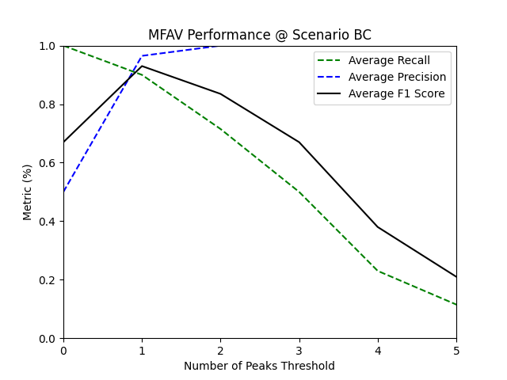
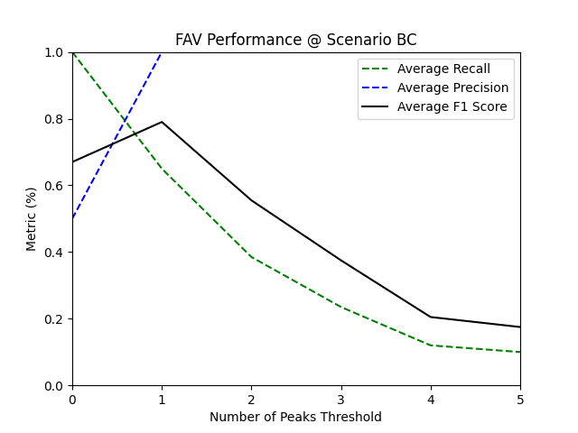
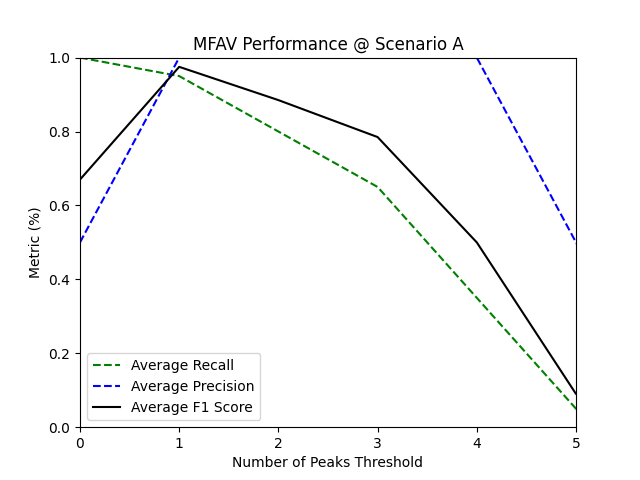
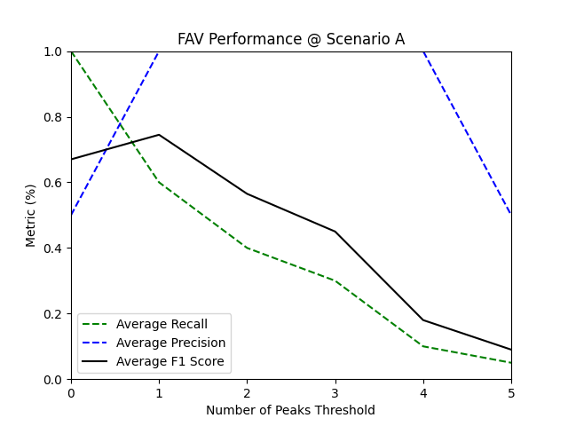
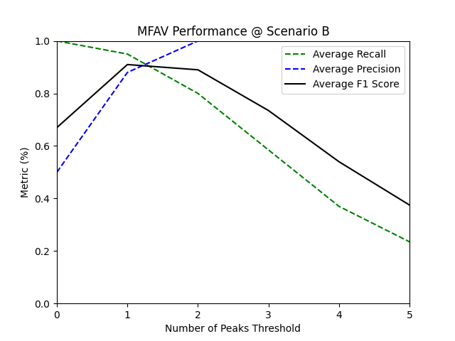
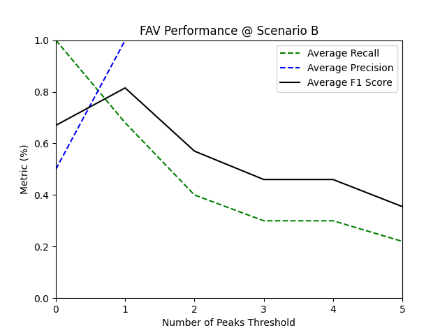
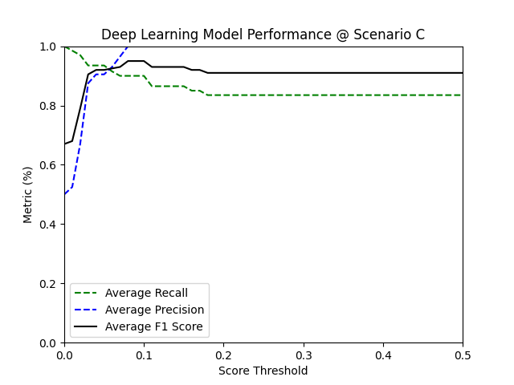

# Tutorial: Vessel-Noise-Detector
This tutorial guides you step-by-step through setting up your project environment and the usage of [vessel_noise_detector.py](./vessel_noise_detector.py) tool, a Python script, designed to process WAV audio recordings and detect vessel-emitted noise.

**Limitation Notice:**
This tool does not handle time zone changes, so users must account for any time zone differences on their own where applicable.

## Contents
- [Introduction](#introduction)
- [Installing Python and Dependencies](#installing-python-and-dependencies)
- [Running the Vessel Noise Detector Command-Line Tool](#running-the-vessel-noise-detector-command-line-tool)
- [The tool's Data Processing Workflow](#the-tools-data-processing-workflow)
- [The Tool in Practice](#the-tool-in-practice)

## Introduction
In this tutorial, we will use the [vessel_noise_detector.py](./vessel_noise_detector.py) tool, a Python command-line script, to identify the presence of marine vessels within a sample dataset and demonstrate how adjusting parameter values affects the detector's performance.

This tool sequentially processes predefined segments of input audio files, generating spectrograms to detect sounds emitted by vessels. The script includes error handling for file processing. If an error occurs while processing a WAV file, it logs the error message but continues processing the remaining files.

The tool offers three alternative methods for detecting vessel noise:
- Frequency Amplitude Variation (FAV) ([methods.pdf](./methods.pdf))
- Modified FAV (MFAV) ([methods.pdf](./methods.pdf))
- Machine learning method (ML)

The `ML` method employs a trained deep learning model for detecting vessel noise. However, please note that the deep learning model may require further tuning for use in new environments.

Whenever the `FAV` or `MFAV` method is selected, in addition to the detected tonal peaks, the tool reports the Sound Pressure Level (SPL, in dB) within specified frequency bands and the Signal-to-Noise Level Difference (SNLD, in dB) across narrow bands surrounding the detected peak frequencies. However, if the `ML` method is selected, only the detection scores and labels for 25-second audio segments within the 50-1000 Hz frequency range — ensuring consistency with the machine learning model — will be reported. 

When available, Automatic Identification System (AIS) data is utilized to offset false negative detections (Note that the timestamp column in an AIS file should be renamed to “DateTime” prior to loading. If this is not done, the tool will treat the AIS file as missing).

Users have the flexibility to customize parameters such as the hydrophone calibration factor (frequency-independent only), detector sensitivity, machine learning detection score threshold, and more. Certain input parameters, which are likely to remain fixed throughout the duration of a project, can be adjusted via the associated JSON configuration file (i.e., [config.json](./config.json)), while others can be fine-tuned through command-line arguments, offering greater flexibility for analysis and adjustments during the project.

Depending on the selected method, the tool generates different CSV output files, which are saved in the specified results directory. The generated CSV files include:

- `FAV_detections.csv`: Containes detected frequency peaks using the FAV approach. Example of a FAV output is shown below.

| filename | start time | end time | freq. band (Hz) | number of peaks | peaks freq. (Hz) | SPL (dB) | SNLD (dB) | AIS |
| -------- | ---------- | -------- | --------------- | --------------- | ---------------- | -------- | --------- | --- |
| ../data/2018-ULU01_0+1_20181111_044220.wav | 2018-11-11 04:42:20 | 2018-11-11 04:44:00 | 50.0 - 1000.0 | 0 | [] | 75.0 | [] | None |
| ../data/2018-ULU01_0+1_20181111_044220.wav | 2018-11-11 04:42:20 | 2018-11-11 04:44:00 | 1000.0 - 2000.0 | 1 | [1498.7] | 73.0 | [2.37] | None |
| ../data/2018-ULU01_0+1_20181111_044220.wav | 2018-11-11 04:44:00 | 2018-11-11 04:45:40 | 50.0 - 1000.0 | 0 | [] | 75.0 | [] | None |
| ../data/2018-ULU01_0+1_20181111_044220.wav | 2018-11-11 04:44:00 | 2018-11-11 04:45:40 | 1000.0 - 2000.0 | 1 | [1498.7] | 70.0 | [3.73] | None |
| ../data/2018-ULU01_0+1_20181111_044220.wav | 2018-11-11 04:45:40 | 2018-11-11 04:47:20 | 50.0 - 1000.0 | 0 | [] | 75.0 | [] | None |
| ../data/2018-ULU01_0+1_20181111_044220.wav | 2018-11-11 04:45:40 | 2018-11-11 04:47:20 | 1000.0 - 2000.0 | 1 | [1498.7] | 71.0 | [3.21] | None |
| ../data/2017-ULU01_0+1_20170725_170602.wav | 2017-07-25 17:06:02 | 2017-07-25 17:07:42 | 50.0 - 1000.0 | 0 | [] | 90.0 | [] | None |
| ../data/2017-ULU01_0+1_20170725_170602.wav | 2017-07-25 17:06:02 | 2017-07-25 17:07:42 | 1000.0 - 2000.0 | 0 | [] | 87.0 | [] | None |
| ../data/2017-ULU01_0+1_20170725_170602.wav | 2017-07-25 17:07:42 | 2017-07-25 17:09:22 | 50.0 - 1000.0 | 0 | [] | 90.0 | [] | None |
| ../data/2017-ULU01_0+1_20170725_170602.wav | 2017-07-25 17:07:42 | 2017-07-25 17:09:22 | 1000.0 - 2000.0 | 0 | [] | 87.0 | [] | None |
| ../data/2017-ULU01_0+1_20170725_170602.wav | 2017-07-25 17:09:22 | 2017-07-25 17:11:02 | 50.0 - 1000.0 | 0 | [] | 90.0 | [] | None |
| ../data/2017-ULU01_0+1_20170725_170602.wav | 2017-07-25 17:09:22 | 2017-07-25 17:11:02 | 1000.0 - 2000.0 | 0 | [] | 87.0 | [] | None |

- `MFAV_detections.csv`: Containing detected frequency peaks using the modified FAV (MFAV) approach. Example of a MFAV output is shown below.

| filename | start time | end time | freq. band (Hz) | number of peaks | peaks freq. (Hz) | SPL (dB) | SNLD (dB) | AIS |
| -------- | ---------- | -------- | --------------- | --------------- | ---------------- | -------- | --------- | --- |
| ../data/2018-ULU01_0+1_20181111_044220.wav | 2018-11-11 04:42:20 | 2018-11-11 04:44:00 | 50.0 - 1000.0 | 3 | [309.0, 374.5, 485.5] | 75.0 | [1.15 8.53 1.6 ] | None |
| ../data/2018-ULU01_0+1_20181111_044220.wav | 2018-11-11 04:42:20 | 2018-11-11 04:44:00 | 1000.0 - 2000.0 | 2 | [1499.5, 1874.5] | 73.0 | [4.2 2.5] | None |
| ../data/2018-ULU01_0+1_20181111_044220.wav | 2018-11-11 04:44:00 | 2018-11-11 04:45:40 | 50.0 - 1000.0 | 2 | [374.5, 485.5] | 75.0 | [8.66 1.7 ] | None |
| ../data/2018-ULU01_0+1_20181111_044220.wav | 2018-11-11 04:44:00 | 2018-11-11 04:45:40 | 1000.0 - 2000.0 | 2 | [1499.5, 1874.5] | 70.0 | [6.44 6.01] | None |
| ../data/2018-ULU01_0+1_20181111_044220.wav | 2018-11-11 04:45:40 | 2018-11-11 04:47:20 | 50.0 - 1000.0 | 2 | [374.5, 485.5] | 75.0 | [8.43 1.38] | None |
| ../data/2018-ULU01_0+1_20181111_044220.wav | 2018-11-11 04:45:40 | 2018-11-11 04:47:20 | 1000.0 - 2000.0 | 2 | [1499.5, 1874.5] | 71.0 | [5.71 5.46] | None |
| ../data/2017-ULU01_0+1_20170725_170602.wav | 2017-07-25 17:06:02 | 2017-07-25 17:07:42 | 50.0 - 1000.0 | 0 | [] | 90.0 | [] | None |
| ../data/2017-ULU01_0+1_20170725_170602.wav | 2017-07-25 17:06:02 | 2017-07-25 17:07:42 | 1000.0 - 2000.0 | 0 | [] | 87.0 | [] | None |
| ../data/2017-ULU01_0+1_20170725_170602.wav | 2017-07-25 17:07:42 | 2017-07-25 17:09:22 | 50.0 - 1000.0 | 0 | [] | 90.0 | [] | None |
| ../data/2017-ULU01_0+1_20170725_170602.wav | 2017-07-25 17:07:42 | 2017-07-25 17:09:22 | 1000.0 - 2000.0 | 0 | [] | 87.0 | [] | None |
| ../data/2017-ULU01_0+1_20170725_170602.wav | 2017-07-25 17:09:22 | 2017-07-25 17:11:02 | 50.0 - 1000.0 | 0 | [] | 90.0 | [] | None |
| ../data/2017-ULU01_0+1_20170725_170602.wav | 2017-07-25 17:09:22 | 2017-07-25 17:11:02 | 1000.0 - 2000.0 | 0 | [] | 87.0 | [] | None |

- `ML_detections.csv`: Contains the ML detection scores and labels for 25-second audio segments within the 50-1000 Hz frequency range, as required by the machine learning model for consistency. An example of the raw ML output with a score threshold of 0.5 is shown below.

| filename | start | end | label | score |
| -------- | ----- | --- | ----- | ----- |
| ../data/2018-ULU01_0+1_20181111_044220.wav | 0.0 | 25.5 | 0 | 0.04 |
| ../data/2018-ULU01_0+1_20181111_044220.wav | 25.0 | 50.5 | 0 | 0.0 |
| ../data/2018-ULU01_0+1_20181111_044220.wav | 50.0 | 75.5 | 0 | 0.0 |
| ../data/2018-ULU01_0+1_20181111_044220.wav | 75.0 | 100.5 | 0 | 0.0 |
| ../data/2018-ULU01_0+1_20181111_044220.wav | 100.0 | 125.5 | 1 | 0.92 |
| ../data/2018-ULU01_0+1_20181111_044220.wav | 125.0 | 150.5 | 0 | 0.23 |
| ../data/2018-ULU01_0+1_20181111_044220.wav | 150.0 | 175.5 | 0 | 0.04 |
| ../data/2018-ULU01_0+1_20181111_044220.wav | 175.0 | 200.5 | 1 | 0.99 |
| ../data/2018-ULU01_0+1_20181111_044220.wav | 200.0 | 225.5 | 0 | 0.24 |
| ../data/2018-ULU01_0+1_20181111_044220.wav | 225.0 | 250.5 | 0 | 0.15 |
| ../data/2018-ULU01_0+1_20181111_044220.wav | 250.0 | 275.5 | 0 | 0.0 |
| ../data/2018-ULU01_0+1_20181111_044220.wav | 275.0 | 300.5 | 0 | 0.09 |
| ../data/2017-ULU01_0+1_20170725_170602.wav | 0.0 | 25.5 | 0 | 0.04 |
| ../data/2017-ULU01_0+1_20170725_170602.wav | 25.0 | 50.5 | 0 | 0.03 |
| ../data/2017-ULU01_0+1_20170725_170602.wav | 50.0 | 75.5 | 0 | 0.03 |
| ../data/2017-ULU01_0+1_20170725_170602.wav | 75.0 | 100.5 | 0 | 0.04 |
| ../data/2017-ULU01_0+1_20170725_170602.wav | 100.0 | 125.5 | 0 | 0.03 |
| ../data/2017-ULU01_0+1_20170725_170602.wav | 125.0 | 150.5 | 0 | 0.03 |
| ../data/2017-ULU01_0+1_20170725_170602.wav | 150.0 | 175.5 | 0 | 0.03 |
| ../data/2017-ULU01_0+1_20170725_170602.wav | 175.0 | 200.5 | 0 | 0.02 |
| ../data/2017-ULU01_0+1_20170725_170602.wav | 200.0 | 225.5 | 0 | 0.03 |
| ../data/2017-ULU01_0+1_20170725_170602.wav | 225.0 | 250.5 | 0 | 0.07 |
| ../data/2017-ULU01_0+1_20170725_170602.wav | 250.0 | 275.5 | 0 | 0.04 |
| ../data/2017-ULU01_0+1_20170725_170602.wav | 275.0 | 300.5 | 0 | 0.05 |

- `MFAV_ML_detctions.csv`: It contains the results from both the MFAV and processed machine learning detectors within the 50-1000 Hz frequency range. An example of combined MFAV_ML output is shown below.

| filename | start time | end time | freq. band (Hz) | number of peaks | peaks freq. (Hz) | SPL (dB) | SNLD (dB) | AIS | ml_label | ml_score |
| -------- | ---------- | -------- | --------------- | --------------- | ---------------- | -------- | --------- | --- | -------- | -------- |
| ../data/2017-ULU01_0+1_20170725_170602.wav | 2017-07-25 17:06:02 | 2017-07-25 17:07:42 | 50.0 - 1000.0 | 0 | [] | 90.0 | [] | None | 0 | 0.04 |
| ../data/2017-ULU01_0+1_20170725_170602.wav | 2017-07-25 17:07:42 | 2017-07-25 17:09:22 | 50.0 - 1000.0 | 0 | [] | 90.0 | [] | None | 0 | 0.03 |
| ../data/2017-ULU01_0+1_20170725_170602.wav | 2017-07-25 17:09:22 | 2017-07-25 17:11:02 | 50.0 - 1000.0 | 0 | [] | 90.0 | [] | None | 0 | 0.05 |
| ../data/2018-ULU01_0+1_20181111_044220.wav | 2018-11-11 04:42:20 | 2018-11-11 04:44:00 | 50.0 - 1000.0 | 3 | [309.0, 374.5, 485.5] | 75.0 | [1.15 8.53 1.6 ] | None | 0 | 0.01 |
| ../data/2018-ULU01_0+1_20181111_044220.wav | 2018-11-11 04:44:00 | 2018-11-11 04:45:40 | 50.0 - 1000.0 | 2 | [374.5, 485.5] | 75.0 | [8.66 1.7 ] | None | 1 | 0.96 |
| ../data/2018-ULU01_0+1_20181111_044220.wav | 2018-11-11 04:45:40 | 2018-11-11 04:47:20 | 50.0 - 1000.0 | 2 | [374.5, 485.5] | 75.0 | [8.43 1.38] | None | 0 | 0.12 |

## Installing Python and Dependencies 
To begin the tutorial and ensure a seamless experience, ensure all the necessary programs and Python packages are installed. Follow these steps to install Python 3 (recommended) and set up your environment with the required dependencies (e.g., NumPy, Pandas, etc.):

### 1. Install Python
If you don't already have Python 3 installed, you can download and install it from the official Python website ([Python Downloads Page](https://www.python.org/downloads/)). Select the `Python 3.8.0` version appropriate for your operating system (Windows OR macOS) and follow the installation instructions, ensuring that you check the option to add Python to your system's PATH (Windows users).

### 2. Create a virtual environment (Optional)
It is RECOMMENDED to create a virtual environment to manage project dependencies independently from other projects. To do this, open a terminal on macOS or Command Prompt on Windows, and navigate to the directory where you want to set up your project. While it is not strictly necessary to create the virtual environment in the working directory, doing so ensures all project-related files and dependencies remain organized and contained in one place. Use the following command to create a virtual environment:
  ```bash
  python3 -m venv detector_env
  ```
This creates a virtual environment named `detector_env`. You may choose a different name for your virtual environment if desired. However, we will continue using the name `detector_env` throughout the following instructions.

Once the `detector_env` virtual environment is created, activate it using the appropriate command for your operating system:

- On **Windows**:
  ```bash
  detector_env\Scripts\activate
  ```
- On **macOS**:
  ```bash
  source detector_env/bin/activate
  ```

### 3. Install dependencies
The [requirements.txt](./requirements.txt) file contains a list of all the third-party Python packages required for the tool to function. To install these dependencies, execute the following command:
```bash
pip install -r requirements.txt
```
**Note:** If you choose to proceed with creating a virtual environment, ensure that you activate it before installing dependencies. You can verify activation by checking the command prompt or terminal, which typically changes to display the name of the environment.

### 4. Deactivate the virtual environment (when done)
Once you're finished working in the virtual environment, you can deactivate it by running:
```bash
deactivate
```
---
---
---

**By now, you should have `Python 3.8.0` installed, the `detector_env` virtual environment set up, and all the required dependencies from the `requirements.txt` file installed and ready to use.**

---
---
---

## Running the Vessel-Noise-Detector Command-Line Tool
The syntax to execute the command-line [tool](./vessel_noise_detector.py) is as follows:
```bash
python3 vessel_noise_detector.py <data_directory> <results_directory> [options]
```
The "python3" command specifies that the tool should be executed using the Python 3 interpreter (tested version). This command is followed by two required positional arguments: 

- `<data_directory>`: The directory containing the WAV files. 
- `<results_directory>`: The output directory where processed results will be saved.

The positional arguments should be passed in the correct order. Directory paths may be specified as absolute or relative. The tool will inspect the data directory and process only files that have a `.wav` extension.

The tool also accepts eleven optional arguments, which can be provided in any order. If not explicitly specified, these arguments will use their default values. Below is a detailed description of the optional arguments available for this tool:

- `--ais_filepath`: Path to the AIS data file. The default path is `./ais/ais.csv`. If AIS data is unavailable, the tool will skip this step, and no additional action is required. **Important: Ensure that the timestamp column in the AIS file is renamed to `DateTime` before loading. If this is not done, the tool will treat the AIS file as missing!**

- `--vessel_type`: Specifies the type of vessel to detect, with two options: `ship` or `ship/boat`. The default value is `ship`, which limits detection to narrow frequency tonal noise peaks typically associated with large, stable vessels. Selecting "ship/boat" relaxes these constraints, enabling the detection of broader tonal frequency peaks that may correspond to small-engine boats. For more details, refer to the [methods.pdf](./methods.pdf) documentation.

- `--score_thr`: This parameter sets the score threshold for machine learning detection. Only detections with scores greater than or equal to this value will be considered positive. The value is in the range [0, 1], where higher values filter out weaker detections, allowing only the most confident results to be reported as positive (default: `0.5`).

- `--freq_band`: Specifies a frequency band for analysis, in addition to those defined in the configuration file. The additional frequency band must be provided as a tuple in the form of `'(min_freq, max_freq)'` (default: `''`).

- `--config`: Specifies the path to a configuration file. The default path is [config.json](./config.json). You can provide different versions of the JSON file as needed. However, ensure that the correct file is specified when executing the tool.

- `--cal`: Calibration factor for converting raw hydrophone output to sound pressure levels in dB re. 1 μPa. This tool accepts a single calibration value, assuming constant hydrophone sensitivity across the working frequency range. The default value is `0`, i.e., the WAV data is already calibrated.

- `--sen`: Sensitivity factor. This factor determines the threshold for detecting tonal noise in the modified FAV method. It defines how much stronger a tonal peak must be relative to the standard deviation of the background sound pressure level (SPL) to be classified as vessel noise. The default value is `3.5`. A sensitivity factor less than 3.5 may result in many false positives and is not recommended. A higher sensitivity factor increases precision but may reduce recall, potentially result in missing some received vessel noise emissions.

- `--mode`: Specifies the mode for writing to the CSV files. Use `'w'` to overwrite the files or `'a'` to append to the existing files. Default is `'a'`.

- `--method`: Four options are available: `'ml'`, `'fav'` `'mfav'`, and `'mfav-ml'`. The last option (`'mfav-ml'`) invokes both ML and MFAV methods. The default value is `'mfav'`).

- `--spec_config`: Specifies the path to the JSON file containing the required spectrogram configuration for the machine learning model. Default is `./spec_config.json`. Ensure that the content of this file matches exactly with the one used during the model training phase!

- `--model`: Specifies the path to the trained deep-learning model. Default is `./vessel_detector_dl_model.kt`.

To see the full list of available command-line arguments along with their default values, run the following command:

```bash
python3 detect_vessel_noise.py --help
```

This returns the following output, displaying both the positional and optional arguments along with the predefined default values of the optional arguments:

```bash
usage: vessel_noise_detector_plus.py [-h] [--ais_filepath AIS_FILEPATH] [--vessel_type VESSEL_TYPE]
                                     [--score_thr SCORE_THR] [--freq_band FREQ_BAND] [--config CONFIG] [--cal CAL]
                                     [--sen SEN] [--mode MODE] [--method METHOD] [--spec_config SPEC_CONFIG]
                                     [--model MODEL]
                                     data_directory results_directory

Process WAV files for audio analysis.

positional arguments:
  data_directory        Path to directory containing WAV files to process.
  results_directory     Path to directory to save processed data results.

optional arguments:
  -h, --help            show this help message and exit
  --ais_filepath AIS_FILEPATH
                        Path to the AIS data file (default: './ais/ais.csv').
  --vessel_type VESSEL_TYPE
                        Type of vessel to detect; options are 'ship' or 'ship/boat' (default: 'ship').
  --score_thr SCORE_THR
                        Machine learning score threshold for confirming the presence of vessel noise. For example,
                        set to 0.85 to only consider detections with a score of 0.85 or higher (default: 0.50).
  --freq_band FREQ_BAND
                        Specific frequency band for analysis as a tuple, e.g., '(10, 100)' (default: '').
  --config CONFIG       Defines the path to the JSON configuration file containing the working parameters (default:
                        'config.json').
  --cal CAL             Calibration factor, i.e., hydrophone sensitivity in decibels (default: 0).
  --sen SEN             Sensitivity factor defining the number of standard-deviation of filtered signal - range: 3.5
                        and above (default: 3.5).
  --mode MODE           Specify the mode for writing to the CSV file. Use 'w' to overwrite the file or 'a' to append
                        to the existing file. Default is 'a' (append).
  --method METHOD       Specify the vessel noise detection method. select 'ml' to use deep-learning model select 'fav'
                        to use FAV method select 'mfav' to use modified_FAV (MFAV) method select 'mfav-ml' to invoke both
                        ML and MFAV methods (Default is 'mfav').
  --spec_config SPEC_CONFIG
                        Specify the path to the JSON file containing the spectrogram configuration for the machine
                        learning model. Default is './spec_config.json'.
  --model MODEL         Specify the path to the trained deep-learning model. Default is './vessel_detector_dl_model.kt'.
```

## The tool's Data Processing Workflow
It can be beneficial to have an understanding of how the tool handles and processes WAV files in order to gain an intuitive sense of its functionality. The tool's processing workflow is as follows:

1.	Command-line argument parsing:
    - The script starts by parsing the command-line arguments to retrieve the required input parameters, which are detailed in the [Running the Vessel Noise Detector Command-Line Tool](#running-the-vessel-noise-detector-command-line-tool) section of this tutorial.
2.	Configuration loading:
    - The script loads configuration settings from the [config.json](./config.json) file, extracting the working parameters including the recording date and time, hydrophone channel number, analysis frequency ranges, segment length, and system noise frequencies.
    - **Note:** The additional configuration file, [spec_config.json](./spec_config.json), will be loaded when the `--method` argument is set to `'ml'` or `'mfav-ml'`.
3.	AIS data handling:
    - The code checks if the specified AIS file exists. If it does, the data is read into a DataFrame, and timestamps are extracted for further processing. Note that the timestamp column in an AIS file should be renamed to `“DateTime”` prior to loading. If this is not done, the AIS file will be treated as missing!  
4.	WAV file processing:
    - A list of WAV files is created by checking the specified data directory for files with ".wav" extension.
    - **For each WAV file:**
      - The file name is extracted, and the recording date and time are determined from the file name. If the date and time information is not provided in the file name, it will default to Unix epoch time, i.e., 00:00:00 UTC on January 1st, 1970. On Windows, the timestamp may show an offset depending on the local time zone's difference from UTC (Coordinated Universal Time).
      - The audio length is calculated.
      - The audio is segmented based on the specified segment length. The script excludes the final portion of the audio file if it is less than 10% of the defined segment length. Otherwise, the last segment overlaps with the previous one and extends to the end of the audio file. 
      - **For each segment:**
        - The audio data is read, and required information and timestamps are generated.
        - AIS data is cross-referenced with the segment's timestamps. If the AIS file is missing, the detection report will return `None`. If the file is available, it will return `1` to indicate the presence of an AIS signal and `0` to indicate its absence during the segment's time span.
        - **For each specified frequency bands in the `spec_config.json` file:**
          - The spectrogram is computed.
          - The system noise frequency peaks, which resemble vessel noise on the spectrogram and consistently appear in hydrophone recordings, are replaced by the local background noise level.
          - Sound Pressure Level (SPL) is calculated.
          - Signal data (i.e. averaged frequency spectrum over time) is extracted and analyzed by FAV or modified FAV (MFAV) methods to define vessel noise frequency peaks. The redundant peaks, i.e., detected peaks from the same continuous event, are also filtered out during the MFAV data processing workflow
          - Signal-to-Noise Level Difference (SNLD in dB) for each detected peak is calculated.
          - The detected tonal peaks are validated using the `SNLD > 0` criteria, and are appended to their respective DataFrames.
          - Validated tonal peaks, SPL, SNLD, and associated AIS label (when available) are appended to each respective FAV or MFAV DataFrame.
          - The DataFrames are continuously updated with new results for each segment and frequency band processed.
5. Running machine learning model:
    - If the `--method` command-line argument is set to `'ml'`, the tool uses a trained deep learning model to detect vessel noise within each `25-second segment`, focusing on the `50-1000 Hz` frequency range, as specified in the `spec_config.json` file. The raw ML results are saved in the `ML_detections.csv` file in the defined results-directory.
    - If the `--method` command-line argument is set to `'mfav-ml'`, the raw machine learning output is processed and merged with the MFAV detection results. For this:
      - The tool checks for time overlap between the machine learning and MFAV detection reports, matches the raw ML detection frequencies to those of the MFAV, updates the detections with the processed ML reports.
      - Next it combines the MFAV and the processed machine learning results, provided that the MFAV report contains detection report within the 50-1000 Hz frequency range.
    
6.	Output:
    - After processing all WAV files, the results are saved to CSV files in the specified results directory. 

---
---
---

# The Tool in Practice
The following case studies demonstrate the use of the detector on a sample dataset, emphasizing its functionality and providing insights into its performance across different configurations and command-line arguments.

The [dataset](./data/) consists of 30 WAV files, each containing 300-second audio recordings collected from Ulukhaktok, located on the west coast of Victoria Island, Canada. Below is a table listing the WAV files along with their corresponding annotations.


| Index | label | filename | comment | vessel |
| ------ | -------- | ------ | ------ | ------ |
| 0 | 1 | 2017-ULU01_0+1_20170726_183602.wav | Distant ship | ship |
| 1 | 1 | 2017-ULU01_0+1_20170728_100602.wav |  | ship |
| 2 | 1 | 2017-ULU01_0+1_20170728_103602.wav |  | ship |
| 3 | 1 | 2017-ULU01_0+1_20170728_143602.wav |  | ship |
| 4 | 1 | 2017-ULU01_0+1_20170728_163602.wav |  | ship |
| 5 | 1 | 2017-ULU01_0+1_20170728_193602.wav |  | ship |
| 6 | 1 | 2017-ULU01_0+1_20170728_210602.wav |  | ship |
| 7 | 1 | 2017-ULU01_0+1_20170809_060602.wav | Distant ship | ship |
| 8 | 1 | 2017-ULU01_0+1_20170809_063602.wav | Distant ship | ship |
| 9 | 1 | 2017-ULU01_0+1_20170809_070602.wav | Distant ship | ship |
| 10 | 0 | 2017-ULU01_0+1_20170930_233602.wav | Windy | none |
| 11 | 0 | 2017-ULU01_0+1_20170930_230602.wav | Windy | none |
| 12 | 0 | 2017-ULU01_0+1_20170930_223602.wav | Windy | none |
| 13 | 0 | 2017-ULU01_0+1_20170930_220602.wav | Windy | none |
| 14 | 0 | 2017-ULU01_0+1_20170930_213602.wav | Windy | none |
| 15 | 0 | 2017-ULU01_0+1_20170930_210602.wav | Windy | none |
| 16 | 0 | 2017-ULU01_0+1_20170930_203602.wav | Windy | none |
| 17 | 0 | 2017-ULU01_0+1_20170930_200602.wav | Windy | none |
| 18 | 0 | 2017-ULU01_0+1_20170930_193602.wav | Windy | none |
| 19 | 0 | 2017-ULU01_0+1_20170930_190602.wav | Windy | none |
| 20 | 1 | 2017-ULU01_0+1_20170725_180602.wav |  | boat |
| 21 | 1 | 2017-ULU01_0+1_20170725_193602.wav |  | boat |
| 22 | 1 | 2017-ULU01_0+1_20170726_113602.wav |  | boat |
| 23 | 1 | 2017-ULU01_0+1_20170727_113602.wav |  | boat |
| 24 | 1 | 2017-ULU01_0+1_20170727_233602.wav |  | boat |
| 25 | 1 | 2017-ULU01_0+1_20170728_113602.wav |  | boat |
| 26 | 1 | 2017-ULU01_0+1_20170728_170602.wav |  | boat |
| 27 | 1 | 2017-ULU01_0+1_20170728_190602.wav |  | boat |
| 28 | 1 | 2017-ULU01_0+1_20170729_123602.wav |  | boat |
| 29 | 1 | 2017-ULU01_0+1_20170729_190602.wav |  | boat |


The recordings include two main categories: those containing vessel noise (20 samples) and those capturing only background noise (10 samples). The WAV files with vessel noise are comprised of ship noise (10 samples) and small-engine boat noise (10 samples). The tool will be used to differentiate between files containing vessel noise (both ship and boat) and those with only background noise.

To get started, follow the steps outlined below:

### 1. Set Up the Project Environment

To begin, navigate to your preferred working directory, where you plan to run the tool, and copy the `config.py`, `spec_config.json`, `vessel_detector_dl_model.kt`, and `vessel_noise_detector.py` files into this directory. Next, follow these steps to set up your environment:

- **Activate the virtual environment (Optional)**

  If you are running the tool in a virtual environment, such as the `detector_env` that we created earlier, activate it before running the script using the following command:
  - On Windows:
  ```bash
  detector_env\Scripts\activate
  ```
  - On macOS:
  ```bash
  source detector_env/bin/activate
  ```

- **Prepare WAV files:** Create a `./data/` directory within the project directory and place your WAV files in it.

- **Set up an output directory:** Create a .`/results/` directory within the project directory to save the tool's results. If you prefer, you can skip this step, and the tool will automatically create an output directory named `./results/`. However, if you'd like a different name for the output directory, you'll need to create it manually.

- **Provide AIS Data (Optional):** If AIS data is available, create a directory named `./ais/` and save the AIS data in CSV format as `ais.csv`. Alternatively, if the AIS data is stored in a different directory or under a different name, specify the correct path using the `--ais_filepath` command-line argument.

  - **Note:** If AIS data is unavailable or the "DateTime" column is missing from the AIS file, the tool will raise a ValueError and skip this step without requiring any further action.

- **Prepare the JSON configuration file**

  The [config.py](./config.py) script generates a JSON configuration file containing essential parameters for the vessel noise detection process. Open the [config.py](./config.py) script to inspect the available parameters and adjust the values in the config dictionary according to your project's requirements. You may also modify the file name and path for the configuration file by updating the `json_file_path = './config.json'` in the script as needed. After making the necessary changes, save the script and run the script from the command line using the following syntax:
  ```bash
  python3 config.py
  ```
  This will create a [configuration](./config.json) file in the specified directory (default: the same directory as `config.py`), which will be loaded by the detector for further analysis. Alternatively, you can directly modify and save the `config.json` file to adjust the parameters without needing to run the `config.py` script.
  
  Running the [config.py](./config.py) script creats the following [configuration setting](./config.json):
  ```bash
  {
      "project_name": "Ulukhaktok",
      "date_position": [15, 22],
      "time_position": [24, 29],
      "channel_number": 1,
      "min_freqs": [50],
      "max_freqs": [1000],
      "segment_length": 100,
      "system_noise_frequencies": [375, 132, 131, 750, 220, 75, 440, 660, 1124, 125]
  }
  ``` 
  The configuration parameters are:
  - project_name: The given name is used for saving the outputs of different projects seperately
  - date_position* (tuple): A tuple indicating the start and end index of the date in the filename.
  - time_position* (tuple): A tuple indicating the start and end index of the time in the filename.
  - channel_number (integer): The channel number to be used when processing stereo audio files. Note that "0" refers to the first channel, and "1" refers to the second channel.
  - min_freqs** (list of floats): The lower end frequencies (Hz) of frequency bands to be analyzed.
  - max_freqs** (list of floats): The upper end frequencies (Hz) of frequency bands to be analyzed.
  - segment_length (integer): The duration (in seconds) of each audio segment for analysis.
  - system_noise_frequencies (list of floats): A list of frequencies (Hz) to mask out during analysis. If left empty, no frequencies will be masked.

  ***Note:** To correctly define the index positions of date and time in a filename, follow these guidelines:
  - Examine the filename format to identify where the date and time appear.
  - Use zero-based indexing to define the start and end positions of the date and time.
  - The date should be a substring of 6 or 8 digits (`YYMMDD` or `YYYYMMDD`).
  - The time should be a substring of 4 or 6 digits (`HHMM` or `HHMMSS`).

  Filenames must include the date in either `YYMMDD` or `YYYYMMDD` format, and the time in `HHMM` or `HHMMSS` format. If this format is not followed, the audio files' start dates and times will default to the Unix Epoch: January 1, 1970, at 00:00:00. On Windows, the timestamp may show an offset depending on the local time zone's difference from UTC (Coordinated Universal Time). In such cases, the AIS column in the results table should not be interpreted.

  For example, for a filename format like `2017-ULU01_0+1_20170828_170602.wav` the date is in the `YYYYMMDD` format and shows up at index 15 to 23 (8 characters), and the time is in the `HHMMSS` format and is at index 24 to 30 (6 characters), so:
  - date_position = (15, 22)  
  - time_position = (24, 29) 

  ****Note:** The corresponding lower and upper frequencies define the frequency bands to be processed. In this example, two frequency bands of 50-200 Hz and 200-1000 Hz will be processed.

### 2. Execute the `vessel_noise_detector.py` Tool

**Base-Case Scenario:**

To run the Base-Case (BC) scenario, use the following command to execute the tool with its default parameters, except for the calibration factor, which has been adjusted for the dataset used in this example:
```bash
python3 detect_vessel_noise.py ./data/ ./results/ --cal=-149.7 --method='mfav'
```
This command reads the sample WAV audio files from the `./data/` directory, calibrates the audio waveforms using the --cal value, process the data using the MFAV method, and saves the detections in the `Ulukhaktok_MFAV_detections.csv` file within the output directory, `./results/` (Note: In this tutorial, the output filenames have been renamed manually to distinguish between the results of different scenarios). All other configuration parameters and input files will be read from the [config.json](./config.json) file, along with the default values set for the optional command-line arguments (run
_**python3 detect_vessel_noise.py --help**_ to see the full list of available arguments and their default values).

The results for the `Base-Case Scenario` can be viewd below:

<details><summary>Click to expand and view the MFAV results</summary>

<div style="font-size: 4px;">

| filename | start time | end time | freq. band (Hz) | number of peaks | peaks freq. (Hz) | SPL (dB) | SNLD (dB) | AIS |
| -------- | ---------- | -------- | --------------- | --------------- | ---------------- | -------- | --------- | --- |
| data/2017-ULU01_0+1_20170728_193602.wav | 2017-07-28 19:36:02 | 2017-07-28 19:37:42 | 50.0 - 1000.0 | 2 | [149.5, 289.0] | 93.0 | [7.54 3.34] | None |
| data/2017-ULU01_0+1_20170728_193602.wav | 2017-07-28 19:37:42 | 2017-07-28 19:39:22 | 50.0 - 1000.0 | 1 | [147.5] | 92.0 | [4.13] | None |
| data/2017-ULU01_0+1_20170728_193602.wav | 2017-07-28 19:39:22 | 2017-07-28 19:41:02 | 50.0 - 1000.0 | 1 | [147.5] | 94.0 | [4.99] | None |
| data/2017-ULU01_0+1_20170930_230602.wav | 2017-09-30 23:06:02 | 2017-09-30 23:07:42 | 50.0 - 1000.0 | 0 | [] | 96.0 | [] | None |
| data/2017-ULU01_0+1_20170930_230602.wav | 2017-09-30 23:07:42 | 2017-09-30 23:09:22 | 50.0 - 1000.0 | 0 | [] | 96.0 | [] | None |
| data/2017-ULU01_0+1_20170930_230602.wav | 2017-09-30 23:09:22 | 2017-09-30 23:11:02 | 50.0 - 1000.0 | 0 | [] | 96.0 | [] | None |
| data/2017-ULU01_0+1_20170809_060602.wav | 2017-08-09 06:06:02 | 2017-08-09 06:07:42 | 50.0 - 1000.0 | 3 | [113.0, 137.5, 150.0] | 80.0 | [1.9  6.01 1.68] | None |
| data/2017-ULU01_0+1_20170809_060602.wav | 2017-08-09 06:07:42 | 2017-08-09 06:09:22 | 50.0 - 1000.0 | 2 | [137.5, 150.0] | 80.0 | [6.34 3.25] | None |
| data/2017-ULU01_0+1_20170809_060602.wav | 2017-08-09 06:09:22 | 2017-08-09 06:11:02 | 50.0 - 1000.0 | 3 | [113.0, 137.5, 150.0] | 80.0 | [2.91 4.33 2.11] | None |
| data/2017-ULU01_0+1_20170726_113602.wav | 2017-07-26 11:36:02 | 2017-07-26 11:37:42 | 50.0 - 1000.0 | 0 | [] | 93.0 | [] | None |
| data/2017-ULU01_0+1_20170726_113602.wav | 2017-07-26 11:37:42 | 2017-07-26 11:39:22 | 50.0 - 1000.0 | 0 | [] | 93.0 | [] | None |
| data/2017-ULU01_0+1_20170726_113602.wav | 2017-07-26 11:39:22 | 2017-07-26 11:41:02 | 50.0 - 1000.0 | 1 | [151.5] | 93.0 | [6.07] | None |
| data/2017-ULU01_0+1_20170930_213602.wav | 2017-09-30 21:36:02 | 2017-09-30 21:37:42 | 50.0 - 1000.0 | 0 | [] | 91.0 | [] | None |
| data/2017-ULU01_0+1_20170930_213602.wav | 2017-09-30 21:37:42 | 2017-09-30 21:39:22 | 50.0 - 1000.0 | 0 | [] | 91.0 | [] | None |
| data/2017-ULU01_0+1_20170930_213602.wav | 2017-09-30 21:39:22 | 2017-09-30 21:41:02 | 50.0 - 1000.0 | 0 | [] | 91.0 | [] | None |
| data/2017-ULU01_0+1_20170725_180602.wav | 2017-07-25 18:06:02 | 2017-07-25 18:07:42 | 50.0 - 1000.0 | 1 | [163.0] | 94.0 | [9.59] | None |
| data/2017-ULU01_0+1_20170725_180602.wav | 2017-07-25 18:07:42 | 2017-07-25 18:09:22 | 50.0 - 1000.0 | 1 | [138.5] | 93.0 | [5.52] | None |
| data/2017-ULU01_0+1_20170725_180602.wav | 2017-07-25 18:09:22 | 2017-07-25 18:11:02 | 50.0 - 1000.0 | 1 | [122.5] | 93.0 | [7.24] | None |
| data/2017-ULU01_0+1_20170728_190602.wav | 2017-07-28 19:06:02 | 2017-07-28 19:07:42 | 50.0 - 1000.0 | 5 | [177.0, 180.5, 361.0, 542.0, 602.0] | 93.0 | [4.1  1.79 1.44 2.29 2.08] | None |
| data/2017-ULU01_0+1_20170728_190602.wav | 2017-07-28 19:07:42 | 2017-07-28 19:09:22 | 50.0 - 1000.0 | 1 | [175.5] | 87.0 | [5.65] | None |
| data/2017-ULU01_0+1_20170728_190602.wav | 2017-07-28 19:09:22 | 2017-07-28 19:11:02 | 50.0 - 1000.0 | 0 | [] | 89.0 | [] | None |
| data/2017-ULU01_0+1_20170930_220602.wav | 2017-09-30 22:06:02 | 2017-09-30 22:07:42 | 50.0 - 1000.0 | 0 | [] | 91.0 | [] | None |
| data/2017-ULU01_0+1_20170930_220602.wav | 2017-09-30 22:07:42 | 2017-09-30 22:09:22 | 50.0 - 1000.0 | 0 | [] | 92.0 | [] | None |
| data/2017-ULU01_0+1_20170930_220602.wav | 2017-09-30 22:09:22 | 2017-09-30 22:11:02 | 50.0 - 1000.0 | 0 | [] | 91.0 | [] | None |
| data/2017-ULU01_0+1_20170727_233602.wav | 2017-07-27 23:36:02 | 2017-07-27 23:37:42 | 50.0 - 1000.0 | 2 | [206.25, 233.0] | 97.0 | [3.66 1.12] | None |
| data/2017-ULU01_0+1_20170727_233602.wav | 2017-07-27 23:37:42 | 2017-07-27 23:39:22 | 50.0 - 1000.0 | 3 | [144.5, 177.0, 532.0] | 93.0 | [4.5  4.01 2.46] | None |
| data/2017-ULU01_0+1_20170727_233602.wav | 2017-07-27 23:39:22 | 2017-07-27 23:41:02 | 50.0 - 1000.0 | 1 | [721.0] | 84.0 | [1.24] | None |
| data/2017-ULU01_0+1_20170729_123602.wav | 2017-07-29 12:36:02 | 2017-07-29 12:37:42 | 50.0 - 1000.0 | 1 | [142.5] | 95.0 | [7.35] | None |
| data/2017-ULU01_0+1_20170729_123602.wav | 2017-07-29 12:37:42 | 2017-07-29 12:39:22 | 50.0 - 1000.0 | 3 | [139.5, 149.0, 418.0] | 92.0 | [5.33 2.24 1.15] | None |
| data/2017-ULU01_0+1_20170729_123602.wav | 2017-07-29 12:39:22 | 2017-07-29 12:41:02 | 50.0 - 1000.0 | 0 | [] | 92.0 | [] | None |
| data/2017-ULU01_0+1_20170930_190602.wav | 2017-09-30 19:06:02 | 2017-09-30 19:07:42 | 50.0 - 1000.0 | 0 | [] | 98.0 | [] | None |
| data/2017-ULU01_0+1_20170930_190602.wav | 2017-09-30 19:07:42 | 2017-09-30 19:09:22 | 50.0 - 1000.0 | 0 | [] | 98.0 | [] | None |
| data/2017-ULU01_0+1_20170930_190602.wav | 2017-09-30 19:09:22 | 2017-09-30 19:11:02 | 50.0 - 1000.0 | 0 | [] | 99.0 | [] | None |
| data/2017-ULU01_0+1_20170728_210602.wav | 2017-07-28 21:06:02 | 2017-07-28 21:07:42 | 50.0 - 1000.0 | 1 | [116.0] | 92.0 | [3.41] | None |
| data/2017-ULU01_0+1_20170728_210602.wav | 2017-07-28 21:07:42 | 2017-07-28 21:09:22 | 50.0 - 1000.0 | 2 | [114.5, 213.0] | 92.0 | [3.   1.08] | None |
| data/2017-ULU01_0+1_20170728_210602.wav | 2017-07-28 21:09:22 | 2017-07-28 21:11:02 | 50.0 - 1000.0 | 3 | [114.5, 206.0, 229.0] | 92.0 | [4.6  2.25 1.66] | None |
| data/2017-ULU01_0+1_20170930_203602.wav | 2017-09-30 20:36:02 | 2017-09-30 20:37:42 | 50.0 - 1000.0 | 0 | [] | 95.0 | [] | None |
| data/2017-ULU01_0+1_20170930_203602.wav | 2017-09-30 20:37:42 | 2017-09-30 20:39:22 | 50.0 - 1000.0 | 0 | [] | 93.0 | [] | None |
| data/2017-ULU01_0+1_20170930_203602.wav | 2017-09-30 20:39:22 | 2017-09-30 20:41:02 | 50.0 - 1000.0 | 0 | [] | 95.0 | [] | None |
| data/2017-ULU01_0+1_20170930_223602.wav | 2017-09-30 22:36:02 | 2017-09-30 22:37:42 | 50.0 - 1000.0 | 0 | [] | 93.0 | [] | None |
| data/2017-ULU01_0+1_20170930_223602.wav | 2017-09-30 22:37:42 | 2017-09-30 22:39:22 | 50.0 - 1000.0 | 0 | [] | 93.0 | [] | None |
| data/2017-ULU01_0+1_20170930_223602.wav | 2017-09-30 22:39:22 | 2017-09-30 22:41:02 | 50.0 - 1000.0 | 0 | [] | 93.0 | [] | None |
| data/2017-ULU01_0+1_20170728_113602.wav | 2017-07-28 11:36:02 | 2017-07-28 11:37:42 | 50.0 - 1000.0 | 4 | [204.5, 214.0, 409.0, 429.0] | 92.0 | [8.59 7.34 6.07 6.58] | None |
| data/2017-ULU01_0+1_20170728_113602.wav | 2017-07-28 11:37:42 | 2017-07-28 11:39:22 | 50.0 - 1000.0 | 2 | [374.5, 485.0] | 76.0 | [8.33 1.19] | None |
| data/2017-ULU01_0+1_20170728_113602.wav | 2017-07-28 11:39:22 | 2017-07-28 11:41:02 | 50.0 - 1000.0 | 8 | [237.0, 355.0, 405.5, 473.0, 507.0, 609.0, 631.0, 710.0] | 83.0 | [5.82 4.46 7.98 4.45 4.51 5.55 5.04 4.85] | None |
| data/2017-ULU01_0+1_20170728_100602.wav | 2017-07-28 10:06:02 | 2017-07-28 10:07:42 | 50.0 - 1000.0 | 4 | [144.5, 177.5, 266.5, 289.0] | 83.0 | [6.76 6.22 4.18 4.79] | None |
| data/2017-ULU01_0+1_20170728_100602.wav | 2017-07-28 10:07:42 | 2017-07-28 10:09:22 | 50.0 - 1000.0 | 5 | [134.0, 144.5, 178.5, 267.0, 289.0] | 87.0 | [8.31 9.09 8.63 5.34 6.31] | None |
| data/2017-ULU01_0+1_20170728_100602.wav | 2017-07-28 10:09:22 | 2017-07-28 10:11:02 | 50.0 - 1000.0 | 4 | [132.0, 264.5, 363.0, 396.5] | 92.0 | [11.46  4.97  3.45  6.64] | None |
| data/2017-ULU01_0+1_20170728_170602.wav | 2017-07-28 17:06:02 | 2017-07-28 17:07:42 | 50.0 - 1000.0 | 3 | [102.5, 203.0, 305.5] | 103.0 | [9.26 2.77 3.62] | None |
| data/2017-ULU01_0+1_20170728_170602.wav | 2017-07-28 17:07:42 | 2017-07-28 17:09:22 | 50.0 - 1000.0 | 3 | [98.5, 103.0, 134.5] | 95.0 | [4.6  3.96 4.89] | None |
| data/2017-ULU01_0+1_20170728_170602.wav | 2017-07-28 17:09:22 | 2017-07-28 17:11:02 | 50.0 - 1000.0 | 3 | [149.5, 300.0, 424.0] | 99.0 | [4.53 2.75 1.14] | None |
| data/2017-ULU01_0+1_20170728_103602.wav | 2017-07-28 10:36:02 | 2017-07-28 10:37:42 | 50.0 - 1000.0 | 2 | [105.5, 210.5] | 90.0 | [11.81  9.8 ] | None |
| data/2017-ULU01_0+1_20170728_103602.wav | 2017-07-28 10:37:42 | 2017-07-28 10:39:22 | 50.0 - 1000.0 | 2 | [104.5, 209.5] | 85.0 | [11.51 10.05] | None |
| data/2017-ULU01_0+1_20170728_103602.wav | 2017-07-28 10:39:22 | 2017-07-28 10:41:02 | 50.0 - 1000.0 | 2 | [104.5, 209.0] | 83.0 | [11.65  9.07] | None |
| data/2017-ULU01_0+1_20170809_063602.wav | 2017-08-09 06:36:02 | 2017-08-09 06:37:42 | 50.0 - 1000.0 | 2 | [113.0, 137.5] | 81.0 | [2.62 6.6 ] | None |
| data/2017-ULU01_0+1_20170809_063602.wav | 2017-08-09 06:37:42 | 2017-08-09 06:39:22 | 50.0 - 1000.0 | 3 | [113.0, 137.5, 150.0] | 81.0 | [2.47 6.88 2.76] | None |
| data/2017-ULU01_0+1_20170809_063602.wav | 2017-08-09 06:39:22 | 2017-08-09 06:41:02 | 50.0 - 1000.0 | 3 | [113.0, 138.0, 150.0] | 81.0 | [2.44 4.16 2.6 ] | None |
| data/2017-ULU01_0+1_20170930_233602.wav | 2017-09-30 23:36:02 | 2017-09-30 23:37:42 | 50.0 - 1000.0 | 0 | [] | 97.0 | [] | None |
| data/2017-ULU01_0+1_20170930_233602.wav | 2017-09-30 23:37:42 | 2017-09-30 23:39:22 | 50.0 - 1000.0 | 0 | [] | 98.0 | [] | None |
| data/2017-ULU01_0+1_20170930_233602.wav | 2017-09-30 23:39:22 | 2017-09-30 23:41:02 | 50.0 - 1000.0 | 0 | [] | 97.0 | [] | None |
| data/2017-ULU01_0+1_20170726_183602.wav | 2017-07-26 18:36:02 | 2017-07-26 18:37:42 | 50.0 - 1000.0 | 3 | [67.5, 73.0, 145.0] | 91.0 | [4.32 5.78 2.74] | None |
| data/2017-ULU01_0+1_20170726_183602.wav | 2017-07-26 18:37:42 | 2017-07-26 18:39:22 | 50.0 - 1000.0 | 1 | [66.5] | 90.0 | [9.25] | None |
| data/2017-ULU01_0+1_20170726_183602.wav | 2017-07-26 18:39:22 | 2017-07-26 18:41:02 | 50.0 - 1000.0 | 0 | [] | 90.0 | [] | None |
| data/2017-ULU01_0+1_20170725_193602.wav | 2017-07-25 19:36:02 | 2017-07-25 19:37:42 | 50.0 - 1000.0 | 3 | [190.0, 366.0, 386.0] | 100.0 | [2.16 1.86 1.2 ] | None |
| data/2017-ULU01_0+1_20170725_193602.wav | 2017-07-25 19:37:42 | 2017-07-25 19:39:22 | 50.0 - 1000.0 | 6 | [109.5, 118.0, 164.0, 218.0, 273.0, 328.0] | 107.0 | [5.69 3.05 3.42 3.68 3.45 2.33] | None |
| data/2017-ULU01_0+1_20170725_193602.wav | 2017-07-25 19:39:22 | 2017-07-25 19:41:02 | 50.0 - 1000.0 | 7 | [80.0, 109.0, 146.5, 153.5, 160.0, 222.0, 292.0] | 107.0 | [7.84 7.97 6.49 5.72 3.37 1.74 3.42] | None |
| data/2017-ULU01_0+1_20170930_210602.wav | 2017-09-30 21:06:02 | 2017-09-30 21:07:42 | 50.0 - 1000.0 | 0 | [] | 93.0 | [] | None |
| data/2017-ULU01_0+1_20170930_210602.wav | 2017-09-30 21:07:42 | 2017-09-30 21:09:22 | 50.0 - 1000.0 | 0 | [] | 94.0 | [] | None |
| data/2017-ULU01_0+1_20170930_210602.wav | 2017-09-30 21:09:22 | 2017-09-30 21:11:02 | 50.0 - 1000.0 | 0 | [] | 92.0 | [] | None |
| data/2017-ULU01_0+1_20170727_113602.wav | 2017-07-27 11:36:02 | 2017-07-27 11:37:42 | 50.0 - 1000.0 | 0 | [] | 90.0 | [] | None |
| data/2017-ULU01_0+1_20170727_113602.wav | 2017-07-27 11:37:42 | 2017-07-27 11:39:22 | 50.0 - 1000.0 | 2 | [155.5, 304.0] | 92.0 | [5.78 2.27] | None |
| data/2017-ULU01_0+1_20170727_113602.wav | 2017-07-27 11:39:22 | 2017-07-27 11:41:02 | 50.0 - 1000.0 | 5 | [122.5, 142.5, 244.0, 538.0, 544.0] | 94.0 | [7.46 5.6  5.4  2.07 1.09] | None |
| data/2017-ULU01_0+1_20170728_143602.wav | 2017-07-28 14:36:02 | 2017-07-28 14:37:42 | 50.0 - 1000.0 | 4 | [139.5, 269.0, 277.0, 281.0] | 94.0 | [4.98 2.43 1.99 2.69] | None |
| data/2017-ULU01_0+1_20170728_143602.wav | 2017-07-28 14:37:42 | 2017-07-28 14:39:22 | 50.0 - 1000.0 | 3 | [140.5, 283.5, 377.0] | 99.0 | [4.71 2.16 1.52] | None |
| data/2017-ULU01_0+1_20170728_143602.wav | 2017-07-28 14:39:22 | 2017-07-28 14:41:02 | 50.0 - 1000.0 | 4 | [141.5, 281.5, 285.0, 415.0] | 97.0 | [7.12 2.81 2.03 1.13] | None |
| data/2017-ULU01_0+1_20170809_070602.wav | 2017-08-09 07:06:02 | 2017-08-09 07:07:42 | 50.0 - 1000.0 | 4 | [113.0, 138.0, 150.5, 213.0] | 80.0 | [3.68 3.69 8.02 1.66] | None |
| data/2017-ULU01_0+1_20170809_070602.wav | 2017-08-09 07:07:42 | 2017-08-09 07:09:22 | 50.0 - 1000.0 | 2 | [138.0, 150.5] | 79.0 | [7.52 5.47] | None |
| data/2017-ULU01_0+1_20170809_070602.wav | 2017-08-09 07:09:22 | 2017-08-09 07:11:02 | 50.0 - 1000.0 | 3 | [112.5, 138.0, 150.0] | 80.0 | [4.52 4.32 2.02] | None |
| data/2017-ULU01_0+1_20170930_200602.wav | 2017-09-30 20:06:02 | 2017-09-30 20:07:42 | 50.0 - 1000.0 | 0 | [] | 96.0 | [] | None |
| data/2017-ULU01_0+1_20170930_200602.wav | 2017-09-30 20:07:42 | 2017-09-30 20:09:22 | 50.0 - 1000.0 | 0 | [] | 96.0 | [] | None |
| data/2017-ULU01_0+1_20170930_200602.wav | 2017-09-30 20:09:22 | 2017-09-30 20:11:02 | 50.0 - 1000.0 | 0 | [] | 96.0 | [] | None |
| data/2017-ULU01_0+1_20170728_163602.wav | 2017-07-28 16:36:02 | 2017-07-28 16:37:42 | 50.0 - 1000.0 | 8 | [121.5, 139.0, 146.0, 188.0, 283.0, 377.0, 398.0, 468.0] | 94.0 | [2.68 1.22 2.87 3.33 2.94 1.45 2.28 1.4 ] | None |
| data/2017-ULU01_0+1_20170728_163602.wav | 2017-07-28 16:37:42 | 2017-07-28 16:39:22 | 50.0 - 1000.0 | 3 | [122.0, 127.0, 188.0] | 95.0 | [1.07 2.97 3.52] | None |
| data/2017-ULU01_0+1_20170728_163602.wav | 2017-07-28 16:39:22 | 2017-07-28 16:41:02 | 50.0 - 1000.0 | 2 | [118.0, 467.5] | 93.0 | [4.56 2.08] | None |
| data/2017-ULU01_0+1_20170729_190602.wav | 2017-07-29 19:06:02 | 2017-07-29 19:07:42 | 50.0 - 1000.0 | 3 | [166.5, 192.0, 357.0] | 99.0 | [6.66 7.5  3.18] | None |
| data/2017-ULU01_0+1_20170729_190602.wav | 2017-07-29 19:07:42 | 2017-07-29 19:09:22 | 50.0 - 1000.0 | 2 | [165.5, 663.0] | 98.0 | [7.68 1.8 ] | None |
| data/2017-ULU01_0+1_20170729_190602.wav | 2017-07-29 19:09:22 | 2017-07-29 19:11:02 | 50.0 - 1000.0 | 4 | [247.5, 372.0, 662.0, 869.0] | 98.0 | [7.67 4.41 3.84 3.37] | None |
| data/2017-ULU01_0+1_20170930_193602.wav | 2017-09-30 19:36:02 | 2017-09-30 19:37:42 | 50.0 - 1000.0 | 0 | [] | 98.0 | [] | None |
| data/2017-ULU01_0+1_20170930_193602.wav | 2017-09-30 19:37:42 | 2017-09-30 19:39:22 | 50.0 - 1000.0 | 0 | [] | 97.0 | [] | None |
| data/2017-ULU01_0+1_20170930_193602.wav | 2017-09-30 19:39:22 | 2017-09-30 19:41:02 | 50.0 - 1000.0 | 1 | [806.0] | 97.0 | [1.29] | None |

</div>

</details>

Note that since there is no AIS file available, the AIS column returns `None`, indicating the absence of an AIS file. If an AIS file were to be included for these sample data, the AIS column would return `1` or `0`, where 1 denotes the presence of an AIS signal, and 0 denotes the absence of an AIS signal for each time segment.

Let us now examine the results produced by the `MFAV` method to assess the performance of the tool. To do this, we will cross-check the tool's detection results with the annotated vessel-noise files (i.e., the table above). The augmented result tables, enhanced with the addition of the annotated column, can be found [here](./results/MFAV_BCS_result_Ulu.csv) for MFAV. These augmented tables will facilitate the generation of various metrics for evaluating the tool's performance. Three performance metrics will be used in this evaluation:

`Recall`: The proportion of actual positive instances correctly identified by the model.

`Precision`: The proportion of predicted positive instances that are truly positive.

`F1-Score`: The harmonic mean of precision and recall, with a weighting factor b (set to 1 for this example) that adjusts the balance between recall and precision.

This dataset is imbalanced, with positive annotations occurring 2 times more frequently than negative annotations. In order to get around the underrating impact of the unbalanced dataset on performance metrics, the positive annotations are partitioned into 2 groups, each of which is paired with the negative annotations to create 2 balanced sub-datasets. For each sub-dataset, the performance metrics are calculated across different thresholds for the number of peaks. The final performance metric curves is derived by averaging the results from two balanced sub-datasets as the representative performance plot, as shown in figure below.



The same test was conducted for the FAV method, and its performance is illustrated below. The augmented result tables, enhanced with an annotated column, can be found [here](./results/FAV_BCS_result_Ulu.csv) for FAV.



The comparison of performance metrics between MFAV and FAV reveals better performance of the MFAV method. The CSV results suggest that MFAV could better capture small-engine boat noise compared to the original FAV, while both methods rejected negative clips almost equally well.

---

**Scenario A:**

Now, let's change the `segment_length` parameter in the [config.json](./config.json) file to **300** seconds, which is equal to the length of the entire clip.
```bash
{
    "project_name": "Ulukhaktok",
    "date_position": [15, 22],
    "time_position": [24, 29],
    "channel_number": 1,
    "min_freqs": [50],
    "max_freqs": [1000],
    "segment_length": 300,
    "system_noise_frequencies": [375, 132, 131, 750, 220, 75, 440, 660, 1124, 125]
}
```
Then, run the following commands:

```bash
python3 detect_vessel_noise.py ./data/ ./results/ --cal=-149.7 --method='mfav' --mode='w'
```
and 
```bash
python3 detect_vessel_noise.py ./data/ ./results/ --cal=-149.7 --method='fav' --mode='w'
```
The commands are the same as in the `Base-Case Scenario`, but now we force the results to be overwritten by using the `--mode='w'` optional comand-line argument (by default, subsequent runs will append the results to the existing CSV output file, i.e., `--mode='a'`).

Performance of MFAV and FAV algorithms in **`Scenario A`** are demonstrated in the figures below. As they highlight, the MFAV performance has improved, while the FAV performed less satisfactorily. Note that for the duration of the presence of a tonal noise in a hydrophone recording, increasing the `segment_length` is expected to enhance the tonal noise of vessels and cancel out random background noise, resulting in an improved signal-to-noise ratio. This would further push the tonal noise component within the high-passed filtered signal in the frequency domain to the outlier region, which can be more effectively detected by the MFAV method. For details of the MFAV algorithm and how it works, refer to the accompanying [methods.pdf](./methods.pdf) document.





--- 

**Scenario B:**

In S**cenario B**, we assume that the system noise frequencies are not known, so we set the `system_noise_frequencies` parameter in the `config.json` file to an empty list []:
```bash
{
    "project_name": "Ulukhaktok",
    "date_position": [15, 22],
    "time_position": [24, 29],
    "channel_number": 1,
    "min_freqs": [50],
    "max_freqs": [1000],
    "segment_length": 100,
    "system_noise_frequencies": []
}
```
Next, run the following commands again:

```bash
python3 detect_vessel_noise.py ./data/ ./results/ --cal=-149.7 --method='mfav' --mode='w'
```
and 
```bash
python3 detect_vessel_noise.py ./data/ ./results/ --cal=-149.7 --method='fav' --mode='w'
```

The performance of the MFAV and FAV algorithms in Scenario B is shown in the figures below, with a slight decrease in MFAV performance due to hydrophone noise, which has led to false positive detections. In contrast, FAV performance appears to improve slightly, likely due to the coincidental coexistence of the hydrophone noise and vessel noise peaks that were not detected by FAV algorithm in the **Base-Case Scenario**.





--- 

**Scenario C:**

**Scenario C** is similar to Scenario BC, with the main difference being that in Scenario C, a machine learning model is used to detect vessel noise. To invoke the trained deep learning model (i.e., `vessel_detector_dl_model.kt`), use the following command:

```bash
python3 vessel_noise_detector_plus.py ../data/ ./results/ --cal=-149.7 --mode='w' --method='ml' --score_thr=0.5
```
To view the CSV result files for this experiment, check the accompanying Results folder. In this experiment, the machine learning CSV output is created using a score threshold of 0.5, as defined by the `--score_thr` command-line argument. The performance of the trained deep learning model in Scenario C is displayed in the figure below. It shows performance metrics across different machine learning score thresholds, which were obtained by adjusting the ml_labels for each threshold (i.e., the result tables are post-processed).

 

**Note:** It's important to note that the model used in this scenario was trained on a larger dataset that includes these samples, so the performance could be questionable. However, for the purpose of demonstrating how to invoke the machine learning method, we have applied it to this dataset. You can also view the performance of the deep learning model on a novel dataset in the README.md document.


